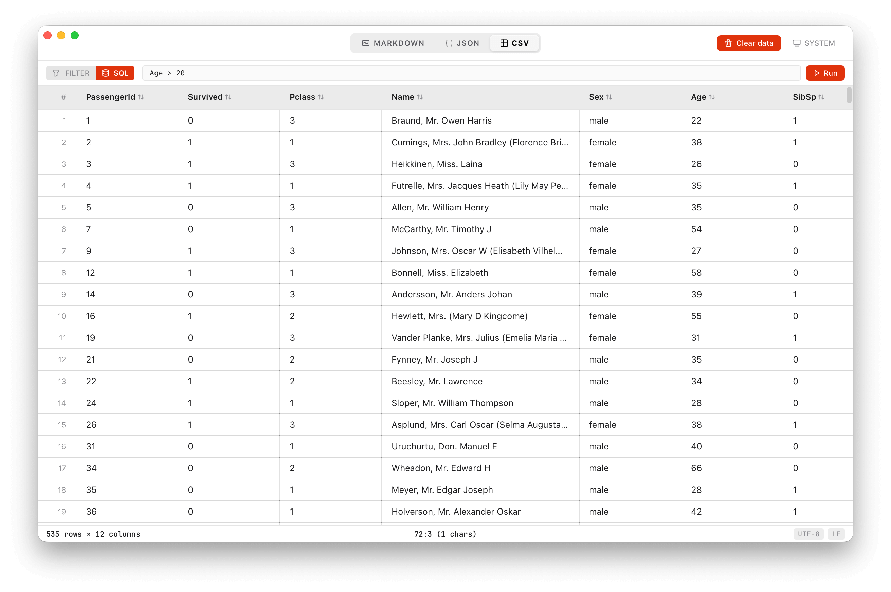

# File Viewers

A cross-platform desktop app for viewing and editing **Markdown**, **JSON**, and **CSV** files with a live split-panel interface. Built with Tauri 2 + React 19.

## Features

- Markdown, JSON, and CSV viewer with live preview
- Split-panel editor — Monaco editor + resizable preview
- CSV: sortable columns, search, and SQL mode
- Open files via `⌘O` or drag-and-drop
- System / Light / Dark theme



## Prerequisites

- [Rust](https://www.rust-lang.org/tools/install) (stable toolchain)
- [Bun](https://bun.sh) `>= 1.0`

**Platform support:** macOS 12+, Linux (GTK), Windows 10+

## Development Setup

```bash
bun install
bun run tauri dev
```

### Other commands

```bash
bun run tauri build   # production bundle for current platform
bunx tsc --noEmit     # type check only
```

## Tech Stack

| Layer | Library |
|-------|---------|
| App shell | Tauri 2 |
| UI | React 19 + TypeScript |
| Build | Vite 7 + Tailwind CSS 4 |
| Editor | Monaco Editor (local bundle, no CDN) |
| Markdown | react-markdown + remark-gfm + rehype-highlight |
| JSON | react-json-view-lite |
| CSV | TanStack Table v8 + PapaParse |
| CSV SQL | alasql (in-memory SQL on `csv` table) |
| UI primitives | Base UI (`@base-ui/react`) |

## Project Structure

```
file-viewers/desktop-app/
├── src/
│   ├── App.tsx                 # Root component, all top-level state
│   ├── App.css                 # Styles + CSS design tokens
│   ├── main.tsx                # Entry point; Monaco local-bundle setup
│   └── components/
│       ├── EditorPanel.tsx     # Monaco editor wrapper
│       ├── PreviewPanel.tsx    # Format router + empty state gate
│       ├── MarkdownPreview.tsx # react-markdown renderer
│       ├── JsonPreview.tsx     # react-json-view-lite renderer
│       ├── CsvPreview.tsx      # TanStack Table + SQL mode + Base UI Tooltip
│       ├── EmptyState.tsx      # Welcome screen
│       └── ui/                 # Button, Input, Textarea primitives
├── src-tauri/
│   ├── src/lib.rs              # Tauri setup; native OS menu
│   ├── tauri.conf.json         # App config
│   └── capabilities/
│       └── default.json        # Tauri permission grants
└── docs/                       # Architecture + component reference
```

## License

MIT — see [LICENSE](LICENSE)

## Docs

- [`desktop-app/docs/architecture.md`](desktop-app/docs/architecture.md) — component hierarchy, state, file loading, theme system, Tauri capabilities
- [`desktop-app/docs/components.md`](desktop-app/docs/components.md) — props reference for every component
